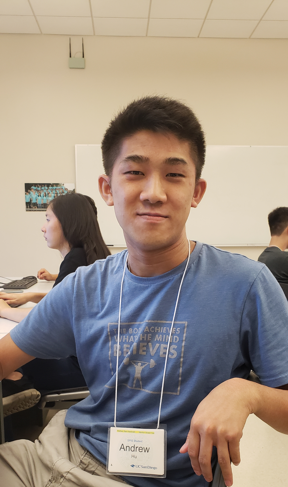

# Located a few hours up north, Los Angeles has been my home for the past 18 years. Entering college, a place where I'll be creating new memories for the next four years, I am very excited with the freedom that comes from this stage in life. Academically, I am extremely excited to be focusing more on a particular field where I can focus, in addition to the liberal arts education. The introduction that SPIS offers to incoming student who are pursuing a study in Computer Science is what attracted me to enroll in this program. While I progress through the five weeks, I hope to engage in a focused environment that will set the stage for the beginning of college and a fun, lively environment with my peers, with whom I'll especially want to play table tennis against.

